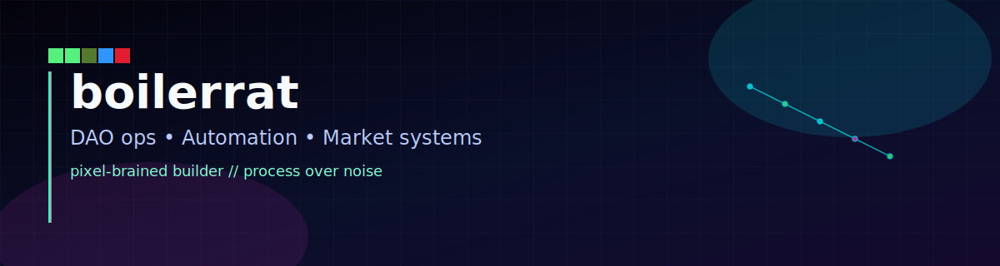

<div align="center">


<br/>


# Boiler (Chris)

### Automated everything except my bad decisions.

[](https://boilerhaus.org)
[](https://t.me/boilerrat)
[](https://warpcast.com/boiler)
[](https://github.com/boilerrat)


</div>

---

## `whoami`

```bash
name="Boiler"
focus=("DAO ops" "automation" "market systems")
default_mode="build practical stuff with guardrails"
anti_pattern="manual repetitive work"
```

---

## Current quests

- ⚙️ **DAO intelligence pipelines** with editorial + validation gates
- 🧠 **Agent memory systems** that keep long-horizon context stable
- 📈 **Risk-first market workflows** (process > prediction)
- 🛠️ **Ops automation** that stays debuggable under pressure

---

## Featured repos

| Project | What it does |
|---|---|
| [awesome-decentralized-autonomous-organizations](https://github.com/boilerrat/awesome-decentralized-autonomous-organizations) | Curated map of DAO knowledge and ecosystem signals |
| [OTRAK](https://github.com/boilermolt/otrak) | Contract-aware overtime allocation engine (facts → review → compiled rules) |
| [DAO Digest](https://github.com/boilermolt/dao-digest) | Repeatable governance/news intelligence pipeline |
| [OpenClaw Weekly](https://github.com/boilermolt/openclaw-weekly) | Weekly ecosystem monitoring and synthesis |

---

## Build doctrine

> Build for **bad days**, not demo days.

- Explicit rules beat vibes.
- Logs are part of the product.
- If a task repeats, automate it.
- High-stakes actions keep a human veto.

---

## Stack


---

<div align="center">

**Signal over noise. Systems over slogans.**

</div>
